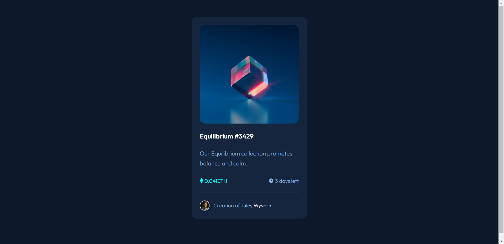

# Frontend Mentor - NFT preview card component solution

This is a solution to the [NFT preview card component challenge on Frontend Mentor](https://www.frontendmentor.io/challenges/nft-preview-card-component-SbdUL_w0U). Frontend Mentor challenges help you improve your coding skills by building realistic projects.

## Table of contents

- [Overview](#overview)
  - [The challenge](#the-challenge)
  - [Screenshot](#screenshot)
  - [Links](#links)
- [My process](#my-process)
  - [Built with](#built-with)
  - [What I learned](#what-i-learned)
  - [Continued development](#continued-development)
- [Author](#author)


## Overview

### The challenge

Users should be able to:

- View the optimal layout depending on their device's screen size
- See hover states for interactive elements

### Screenshot



### Links

- [Solution URL](https://github.com/sayednaser/nft-preview-card-component-frontendmentor)
- [Live Site URL](https://sayednaser.github.io/nft-preview-card-component-frontendmentor/)

## My process

### Built with

- HTML5
- CSS

### What I learned

This is my first challenge. I have exploited it to apply my knowledge about the basis of CSS, without so modern technology.

The most standard practice to set box-sizing to border-box is:

```css
*,
*:before,
*:after {
  margin: 0;
  padding: 0;
  box-sizing: border-box;
}
```

---

Working with "rem" units helps us resize all the layout and typography with a single edit on the root element. A good practice is to set the root font-size to 10px (62.5% \* initial-font-size=16px), so that 1rem = 10px.

```css
html {
  font-size: 62.5%;
}
```

---

Typically, typography-related properties are inherited. We can take advantage of that by setting the most general typography properties on body element.

```css
body {
  font-family: "Outfit", sans-serif;
  font-weight: 300;
  line-height: 1.7;
  background-color: hsl(217, 54%, 11%);
  color: hsl(215, 51%, 70%);
}
```

## **Note: Inheritance is always from the parent element in the document tree, even when the parent element is not the containing block. (MDN)**

Basic layout can be implemented by floating. We can also implement a full grid with float, but no need for that in the current project.

**Note: We use clearfix in two situations:**

1. All the elements inside a container are floated, so the container has a 0 height.

2. The maximum height for floating elements is larger than the maximum height for other elements, so some floating elements are out of boundaries.

```css
.container::after {
  content: "";
  display: table;
  clear: both;
}
```

A newer solution is to make the container establish a new Blocking Formatting Context (BFC).

```css
.container {
  display: flow-root;
}
```

---

Centering text in a single line can be done by vertical-align: middle: It aligns inline-box with line-box.

```css
.eth-logo,
.time-logo,
.eth span,
.time span {
  vertical-align: middle;
}
```

---

Setting visibility: hidden while hovering can lead to inconsistent result, we can use opacity: 0 if we want the element to take its space in flow.

```css
.logo-img:hover {
  opacity: 0;
}
```

---

We can apply more than one background images, the first one is the nearest to the user. We can also use linear-gradient with 2 same colors just to apply the color-overlay effect.

```css
.logo-container:hover {
  background-image: url(images/icon-view.svg), linear-gradient(
      0deg,
      hsla(178, 100%, 50%, 0.5),
      hsla(178, 100%, 50%, 0.5)
    ), url(images/image-equilibrium.jpg);
  background-size: auto, cover, cover;
  background-repeat: no-repeat;
  background-position: center;
}
```

### Continued development

Most challenges for this project, especially in the layout/centering can be solved quite easily with flexbox. Maybe I will review it and start using it from the next challenge.

## Author

- Github - [@sayednaser](https://github.com/sayednaser)
- Frontend Mentor - [@sayednaser](https://www.frontendmentor.io/profile/sayednaser)
